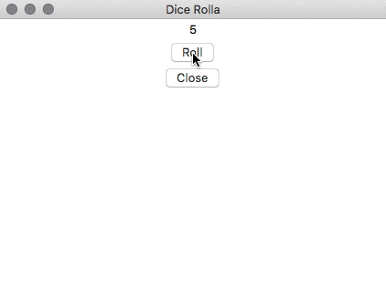

# Dice Rolla
Dice Rolling Simulator from [Five mini programming projects for the Python beginner](https://knightlab.northwestern.edu/2014/06/05/five-mini-programming-projects-for-the-python-beginner/)

## The Goal
Like the title suggests, this project involves writing a program that simulates rolling dice. When the program runs, it will
- randomly choose a number between 1 and 6
- print what that number is
- ask you if you’d like to roll again

For this project, you’ll need to set the min and max number that your dice can produce. For the average die, that means a minimum of 1 and a maximum of 6. You’ll also want a function that randomly grabs a number within that range and prints it.

**Concepts to keep in mind:**
- Random
- Integer
- Print
- While Loops

A good project for beginners, this project will help establish a solid foundation for basic concepts. And if you already have programming experience, chances are that the concepts used in this project aren’t completely foreign to you. Print, for example, is similar to Javascript’s console.log.

## Thoughts
I actually did a GUI using Tkinter, so I didn't need to use the `while` loop or ask the user if they want to roll again.

## Links
- Dice Rolling Simulator from [Five mini programming projects for the Python beginner](https://knightlab.northwestern.edu/2014/06/05/five-mini-programming-projects-for-the-python-beginner/)
- [Converting integer to string in Python](https://stackoverflow.com/questions/961632/converting-integer-to-string-in-python)
- [Introduction to GUI programming with tkinter](http://python-textbok.readthedocs.io/en/1.0/Introduction_to_GUI_Programming.html)
